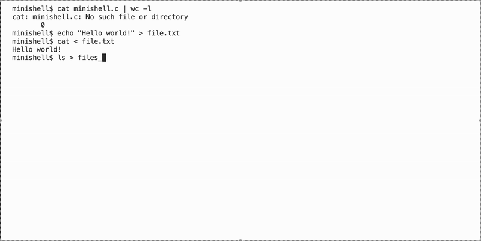
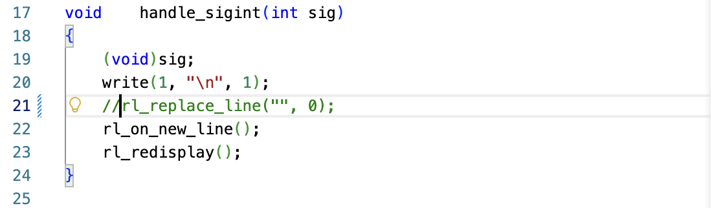

## Minishell
## Our own simple bash.
We did this project with my teammate to deepen our understanding of Unix shell concepts.
It supports executing commands, handling environment variables, and implementing key shell features such as pipes, redirections, and built-in commands.


Minishell is a simple Unix shell made in C. It allows users to manage processes, run commands, and interact with the system in a straightforward and secure manner. 

It supports key shell features. These include:

🪠Piping between commands

🏞️Handling environment variables

🔣Input/output redirection

🚀Command execution

Minishell is a great tool for students and developers. Doing this project helped us understand how shells work.
This project gave us hands-on experience. We worked with system calls, managed processes, and explored low-level programming concepts.


## Installation

To use Minishell, you need a Unix-like environment (Linux or macOS) and a C compiler (like `gcc`). Follow these steps:

1. **Clone the repository:**
  ```bash

git clone https://github.com/your-username/minishell.git

cd minishell 
```
2. **Compile the project:**
```bash
make
```
This will create the executable minishell.

## Usage
1.	**Start Minishell:**

  	```bash
    ./minishell
  `
  2.	**Run commands just like in a regular shell:**

```bash
ls
pwd
echo "Hello, Minishell!"
  ```
  4.	**Use pipes and redirections:**
```bash
ls -l | grep ".c"
echo "Hello World" > file.txt
cat < file.txt
  ```
  5.	**Work with environment variables:**
```bash
export MYVAR="Minishell Test"
echo $MYVAR
  ```
  6.	**Exit Minishell:**
```bash
exit
```




If you are using Mac, you probably will get a compile time error related to rl_replace_line function. Just comment it and try to compile again.



## Contributing 🛠️

We welcome contributions! If you want to help improve Minishell, follow these steps to set up the project for development:

1. **Fork the repository**  
Click the "Fork" button on GitHub to create your own copy of the project.

2. **Clone your fork locally:**
```bash
git clone https://github.com/your-username/minishell.git
cd minishell
```
3. **Create a new branch for your feature or fix:**
```bash
git checkout -b feature-name
```
4. **Build the project using the Makefile:**
```bash
make
```
	•	This will compile the project and create the minishell executable.
	•	Use make clean to remove compiled files if needed.
5. **Run Minishell locally to test your changes:**
```bash
./minishell
```
6. **Make your changes**
Edit the code in your favorite editor and test frequently.

7. **Commit your work with a clear message:**
```bash
git add .
git commit -m "Add feature or fix issue"
```
8. **Push your branch to your fork:**
```bash
git push origin feature-name
```
9. **Open a Pull Request**

Go to the original repository on GitHub and open a PR from your branch. Describe your changes clearly so we can review them.

